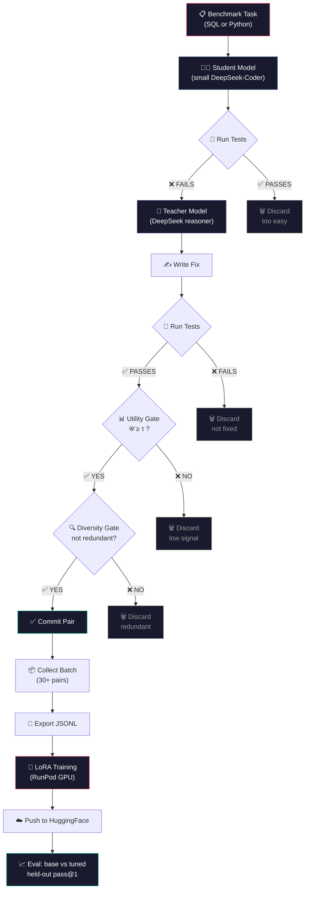

# ShipToPod

> **Find a small code model's blind spots, verify them by running the code, and distill a strong teacher's fixes into it via LoRA on real GPUs.**

ShipToPod is an autonomous **fine-tuning factory** for backend code. It draws adversarial
coding tasks from real benchmarks, has a small **student** model attempt them, verifies
failures by **actually running the tests**, has a strong **teacher** (DeepSeek) write the
fix, and LoRA-trains the student on those fixes — then ships the adapter to a fresh
Hugging Face repo and measures the improvement on a held-out eval split.

The reward signal is objective: generated code either passes its tests or it doesn't.

---

## How it works



---

## Languages

**SQL** (verified against an in-process SQLite fixture) and **Python** (verified with
`pytest` in a sandboxed subprocess) ship first, behind a pluggable `Runner` interface so
Rust and Java drop in next.

---

## Architecture

| Layer | Tech |
|---|---|
| Monorepo | pnpm 10 + Turborepo |
| Teacher (strong solver) | **DeepSeek** hosted API (`deepseek-reasoner`) |
| Student (weak solver + fine-tune target) | small **DeepSeek-Coder** (~1.3B), LoRA |
| Auditor (reward signal) | code-execution runners — SQLite (SQL), `pytest` subprocess (Python) |
| Tasks | MBPP / HumanEval (Python) + Spider / WikiSQL (SQL), held-out eval split |
| Embeddings (diversity gate) | local model (bge/gte), no API |
| Training | **RunPod** (`runpodctl` CLI + MCP server) for LoRA on GPU pods; legacy Prime Intellect still available |
| Persistence | MongoDB Atlas (runs, pairs, events) |
| Frontend | Next.js 15 dashboard — the fine-tuning cockpit |
| Deployment | Render |

See [`docs/superpowers/specs/2026-06-30-backend-task-factory-pivot-design.md`](docs/superpowers/specs/2026-06-30-backend-task-factory-pivot-design.md)
for the full design and [`docs/MATH.md`](docs/MATH.md) for the utility / diversity math.

---

## Repo layout

```
apps/web/            Next.js dashboard — fine-tuning cockpit
                      ├── Task / test-run view  — prompt → weak fails → strong passes
                      ├── Compute Console       — live LoRA loss curve
                      └── Eval                  — held-out pass@1, base vs. LoRA
packages/core/       Zod schemas + shared contracts (CodeTask, RunResult, TrainingPair)
packages/inference/  DeepSeek client + runners (SQL/Python) + benchmark loader + loop
packages/trainer/    GPU provider layer (Prime legacy + RunPod) + dataset export + LoRA training script
packages/runpod-mcp/ RunPod MCP server — external AI agents manage pods via MCP protocol
packages/db/         MongoDB Atlas persistence (runs, pairs, events)
docs/                Design spec + math
```

---

## Getting started

```bash
pnpm install
cp .env.example .env.local   # fill in DEEPSEEK_API_KEY, RUNPOD_API_KEY, HF_TOKEN
pnpm turbo run build type-check
pnpm dev                      # opens http://localhost:3000
```

### Required env vars

| Variable | Purpose |
|----------|---------|
| `DEEPSEEK_API_KEY` | Teacher (strong solver) + optional task augmentation |
| `STUDENT_PROVIDER` | Student inference backend (`vllm`, `local`, or `runpod-flash`) |
| `STUDENT_BASE_URL` | Inference endpoint for the small student (vLLM on RunPod or local) |
| `RUNPOD_API_KEY` | GPU pod provisioning for LoRA training (replaces PRIME_API_KEY) |
| `BBB_TRAINING_PROVIDER` | Training backend: `runpod` (default) or `prime` (legacy) |
| `HF_TOKEN` | Hugging Face model download + per-run adapter push |
| `MONGODB_ATLAS_URI` | Run / pair persistence (optional — loop works without it) |

---

## Bright Data & Runpod Flash integration

ShipToPod supports two optional integrations for scaling the task pipeline:

### Bright Data (task augmentation)

Bright Data's web scraping infrastructure can augment the benchmark task pool with
real-world coding problems scraped from competitive-programming sites, Stack Overflow,
and open-source issue trackers. Each scraped problem is automatically converted into a
`CodeTask` with a test suite so it flows through the standard break-and-fix loop.

Enable by setting `BRIGHTDATA_API_KEY` and a scraping config in `packages/inference/`.

### RunPod GPU training (replaces Prime Intellect)

ShipToPod now uses **RunPod GPU Cloud** for LoRA fine-tuning, replacing Prime Intellect.
Pod provisioning, SSH access, and teardown are handled by `runpodctl` CLI, with the same
SSH-based remote training flow already proven in the Prime path.

**MCP server**: The official `@runpod/mcp-server` is configured so AI coding agents
(Claude Code, Cursor, etc.) can manage RunPod resources directly:

```bash
npx @runpod/mcp-server@latest add   # guided installer
# or manually: set RUNPOD_API_KEY and launch the server
```

### Runpod Flash (serverless student inference)

Instead of running the student model on a dedicated vLLM pod, you can offload inference
to [Runpod Flash](https://www.runpod.io/serverless-gpu) — a serverless GPU endpoint that
scales to zero when idle and auto-scales under load. This is ideal for cost-sensitive
loops where the student only runs intermittently.

Set these env vars to enable:

```bash
STUDENT_PROVIDER=runpod-flash
STUDENT_BASE_URL=https://api.runpod.ai/v2/<your-endpoint-id>/openai/v1
```

The ShipToPod engine talks to Runpod Flash through its OpenAI-compatible API — no Runpod
SDK needed in the core loop.

---

## Status

**Pivot implemented; engine loop running.** The repo has been migrated from the BrickByBrick
visual UI-audit prototype to the ShipToPod backend-code fine-tuning factory. See the design
spec linked above for the full architecture; implementation is tracked in the monorepo
packages.
